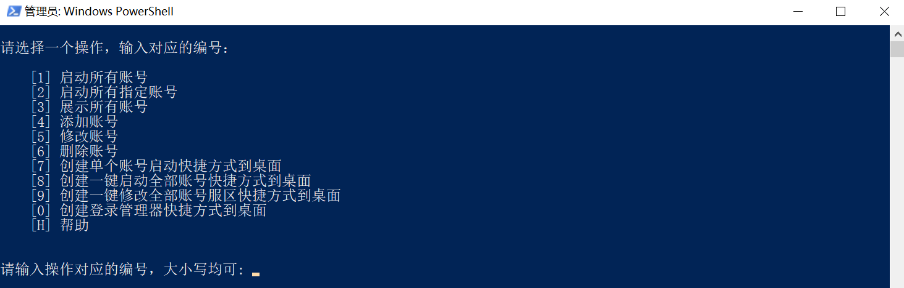
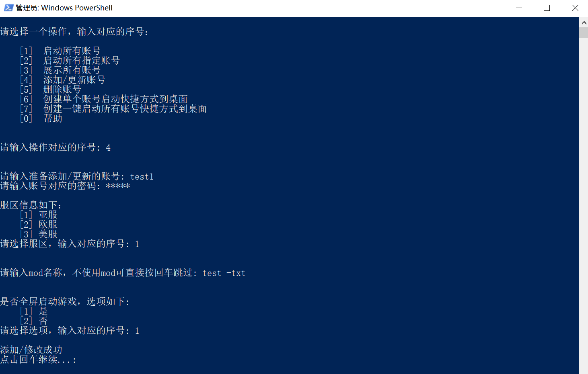
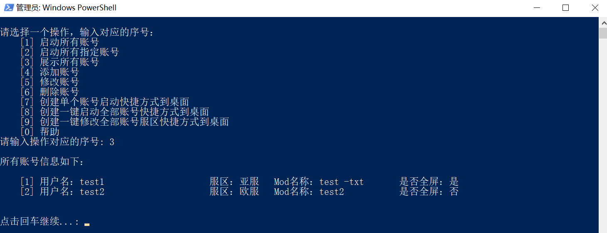
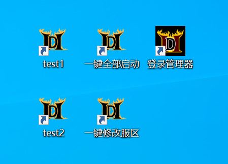

# D2R-fast-launcher(暗黑2快捷登录器)
github地址：https://github.com/faliny/D2R-fast-launcher

#工具介绍
这是一款基于PowerShell脚本编写的暗黑2游戏快捷登录器，旨在帮助更多热爱暗黑2的游戏玩家一键多开，创造更好的游戏体验：

* 登录器会绕过战网程序直接启动并登录暗黑2游戏；
* 登录器里可以分别对各个账号设置使用的mod和是否全屏游戏（电脑配置不高的可以把小号都设置使用blockhd这个mod）；
* 多开时登录器会自动杀掉暴雪的防多开进程，实现一键多开；
* 通过登录器，能针对录入账号分别生成单号启动的快捷方式，也能生成一键全部启动的快捷方式，想怎么启动就怎么启动；

这是本人第一次接触PowerShell，部分基础功能借鉴了Chobotz的源码（github地址：https://github.com/Chobotz/D2R-multiclient-tools）
若发现bug或有改进建议，请留言交流。

另附暗黑2赛季专家交流群：107824969

# 适用人群
* 单开且懒得开战网的用户
* 使用同一台电脑多开的用户

# 使用方法
1. 将files目录下的所有文件复制到暗黑2游戏的主目录下
2. 双击打开登录管理器，根据提示将账号信息依次录入
3. 创建登录快捷方式到桌面，打开对应快捷方式启动游戏

# 注意: 
```diff
- 不要在登录战网的情况下通过启动器启动游戏，若需使用，请先关闭战网程序.
- 若微软发布了新的handle64程序版本，可自行下载更新，地址：https://docs.microsoft.com/en-us/sysinternals/downloads/handle
```

# 工具截图
1、登录管理器主界面



2、添加/更新账号配置



3、查看账号配置



4、创建快捷方式到桌面



# 申明
非盈利性质工具，任何风险请自行承担
  
# 常见/已知问题: 
* 如果遇到重复的验证码验证循环，将C:\Users\User\AppData\Local\Battle.net\Cache目录下的所有内容删除后重试
* 如果遇到无法登录的情况，使用正常的方式通过战网登录该账号，进行客户端更新或身份验证
