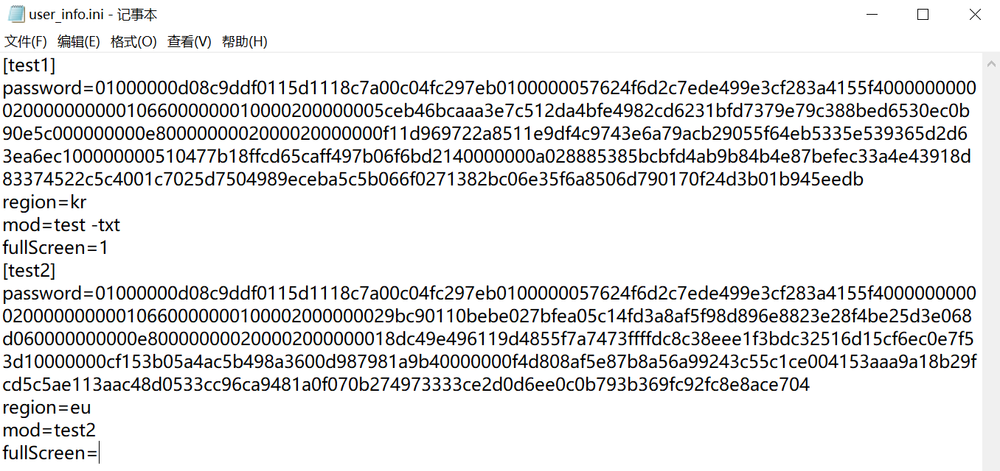

# D2R-fast-launcher(暗黑2快捷登录器)
github地址：https://github.com/faliny/D2R-fast-launcher

# 工具介绍
这是一款基于PowerShell脚本编写的暗黑2重置版游戏快捷登录器，旨在帮助更多热爱暗黑2的游戏玩家一键多开，创造更好的游戏体验：
* 登录器会绕过战网程序直接启动并登录暗黑2重置版
* 多开时登录器里可以分别对各个账号做启动配置
* 多开时登录器会使用微软官方的工具杀掉暴雪的防多开进程，实现一键多开
* 通过登录器，能针对录入的账号分别生成单个账号启动快捷方式，也能生成一键全部启动快捷方式，且不限制账号个数
* 不需要复制多份游戏文件，只一份游戏文件即可
* 登录器的原理不涉及作弊，理论上没有封号风险

这是本人第一次接触PowerShell，部分基础功能借鉴了Chobotz的源码（github地址：https://github.com/Chobotz/D2R-multiclient-tools ）若发现bug或有改进建议，请留言交流。

另附暗黑2赛季专家交流群：107824969（本人群昵称：冰蛙，欢迎送我装备◠‿◠）

# 适用人群
* 单开且懒得开战网的用户
* 使用同一台电脑多开的用户

# 使用方法
1. 将files目录下所有文件复制到暗黑2游戏的主目录下
2. 双击打开登录管理器，根据提示将账号信息依次录入
3. 在登录管理器里选择创建登录快捷方式到桌面，打开对应快捷方式启动游戏

# 下载方式
打开<a href="https://github.com/faliny/D2R-fast-launcher/releases" target="_blank">工具下载页面</a>，选择要下载的版本，展开Assets，随便选择一个Source code下载即可。


# 注意: 
```diff
- 不要在登录战网的情况下通过启动器启动游戏，若需使用，请先关闭战网程序；
- 文件中的登录管理器本身也是一个快捷方式，不能直接复制到桌面，可在游戏目录下打开登录管理器后选择创建快捷方式到桌面；
```

# 工具截图
1、登录管理器主界面


2、添加账号配置


3、创建启动单个账号快捷方式到桌面


4、桌面快捷方式


5、本地用户配置文件



# 申明
非盈利性质工具，任何风险请自行承担

# 常见/已知问题: 
* 如果遇到双击快捷登录器没有反应的情况，先去游戏目录的Launcher文件夹下查看D2R launcher.ps1文件是否存在，如不存在，则很可能是被杀毒软件删除了，此时可以从杀毒软件里恢复，也可以重新下载，记得去杀毒软件里添加白名单；
* 如果遇到重复的验证码验证循环，将C:\Users\User\AppData\Local\Battle.net\Cache目录下的所有内容删除后重试
* 如果遇到无法登录的情况，请使用正常方式通过战网登录该账号，进行客户端更新或身份验证，完成后便可继续使用快捷登录器登录
